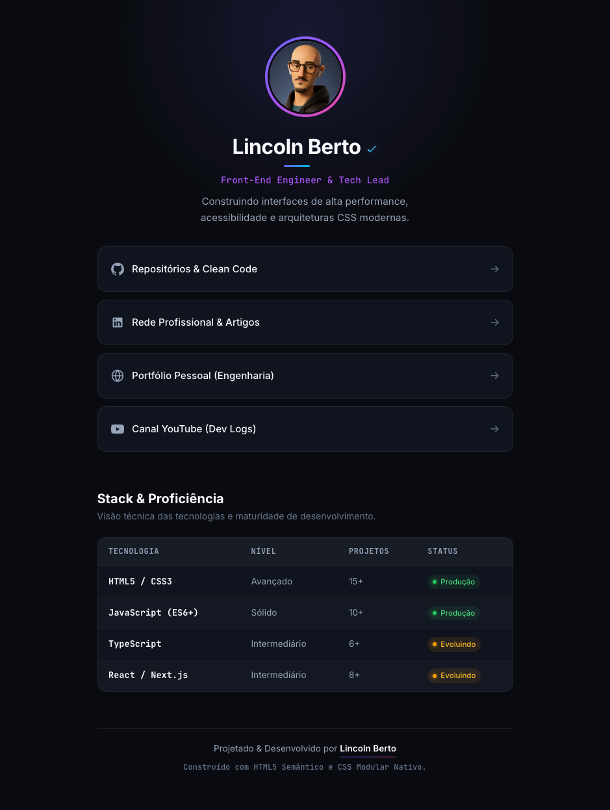

# ⚡ Tech Hub & Developer Bio — Lincoln Berto

> Hub de conexões profissionais e matriz de maturidade técnica front-end de alta performance, construído com HTML5 Semântico, Design Tokens e CSS3 Modular Nativo.

---

## 📸 Preview

  

---

## 🎯 Sobre o Projeto

Este projeto consiste na refatoração completa de uma interface de Link na Bio, convertendo uma estrutura didática em um produto digital moderno, acessível (A11y) e focado em engenharia de software limpa.

### 🛠️ Stack Tecnológica & Decisões de Arquitetura

- **HTML5 Semântico Estrito:** Estruturação através de tags nativas (`<header>`, `<nav>`, `<main>`, `<section>`, `<table>`, `<footer>`), eliminando a proliferação de `divs` desnecessárias.
- **CSS Modular Nativo:** Separação de responsabilidades desacoplada (`variables.css`, `reset.css`, `base.css`, `profile.css`, `links.css`, `matrix.css`, `footer.css`) orquestrada via `@import`.
- **Design Tokens Globais:** Variáveis CSS centralizadas em `:root` para cores de superfície, gradientes, tipografia e raios.
- **Pseudo-classes & Pseudo-elementos:** Aplicação extensiva de `::before` e `::after` (anel de gradiente com micro-interações, linhas indicadoras, barras de brilho) e pseudo-classes estruturais (`:nth-child()`, `:hover`, `:active`, `:focus-visible`).
- **Responsividade Fluida:** Tipografia calculada via `clamp()`, eliminando quebras abruptas de layout.

---

## 👨‍💻 Autor

Desenvolvido por **Lincoln Berto**

- 🌐 Portfólio: [lincolnberto.com](https://lincolnberto.com)
- 💼 LinkedIn: [linkedin.com/in/lincoln-berto](https://www.linkedin.com/in/lincoln-berto/)
- 🐙 GitHub: [@eilincoln](https://github.com/eilincoln)
